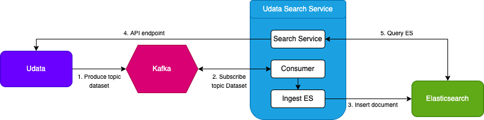

# udata-search-service

A search service for udata.
The idea is to have search service separated from the udata MongoDB.
The indexation update is made using real-time HTTP messages.

See the following architecture schema:


## Getting started

You can follow this recommended architecture for your code:
```
$WORKSPACE
├── fs
├── udata
│   ├── ...
│   └── setup.py
│		└── udata.cfg
├── udata-front
│   ├── ...
│   └── setup.py
└── udata-search-service
    ├── ...
    └── pyproject.toml
```

Clone the repository:
```
cd $WORKSPACE
git clone git@github.com:opendatateam/udata-search-service.git
```

Start the different services using docker-compose:
```
cd udata-search-service
docker-compose up
```

This will start:
- an elasticsearch
- a search app

Initialize the elasticsearch indices on setup.
```
# Locally
udata-search-service init-es

# In the docker context
docker-compose run --entrypoint /bin/bash web -c 'udata-search-service init-es'
```

This will create the following indices:
- {UDATA_INSTANCE_NAME}-dataset-{yyyy}-{mm}-{dd}-{HH}-{MM}
- {UDATA_INSTANCE_NAME}-reuse-{yyyy}-{mm}-{dd}-{HH}-{MM}
- {UDATA_INSTANCE_NAME}-organization-{yyyy}-{mm}-{dd}-{HH}-{MM}

Configure your udata to use the search service, by updating the following variables in your udata.cfg.
Ex in local:
```
    SEARCH_SERVICE_API_URL = 'http://127.0.0.1:5000/api/1/'
```

Using [udata](https://github.com/opendatateam/udata), when you modify objects,
indexation messages will be sent to the search app and will be consumed by the API.

If you want to reindex your local mongo base in udata, you can run:
```
cd $WORKSPACE/udata/
source ./venv/bin/activate
udata search index
```
Make sure to have the corresponding UDATA_INSTANCE_NAME specified in your udata settings.

You can specify the option `--reindex` to start indexation on new indexes.
At the end of this reindexation by udata, `/set-index-alias` route is called to change the alias accordingly.

You can query the search service with the search service api, ex: http://localhost:5000/api/1/datasets/?q=toilettes%20à%20rennes

## Development

You can create a virtualenv, activate it and install the requirements with the following commands.
```
python3 -m venv venv
source venv/bin/activate
make deps
make install
```

You can start the web search service with the following command:
```
udata-search-service run
```

## Deployment

The project depends on [ElasticSearch](https://www.elastic.co/guide/index.html) 7.16.

Elasticsearch requires the [Analysis ICU](https://github.com/elastic/elasticsearch-analysis-icu)
plugin for your specific version.
On Debian, you can take a look at these
[instructions](https://www.elastic.co/guide/en/elasticsearch/reference/7.16/deb.html) for installation.

## Troubleshooting

- If the elasticsearch service exits with an error 137, it is killed due to out of memory error. You should read the following points.
- If you are short on RAM, you can limit heap memory by setting `ES_JAVA_OPTS=-Xms750m -Xmx750m` as environment variable when starting the elasticsearch service.
- If you are on MAC and still encounter RAM memory issues, you should increase Docker limit memory to 4GB instead of default 2GB.
- If you are on Linux, you may need to double the vm.max_map_count. You can set it with the following command: `sysctl -w vm.max_map_count=262144`.
- If you are on Linux, you may encounter permissions issues. You can either create the volume or change the user to the current user using `chown`. 
